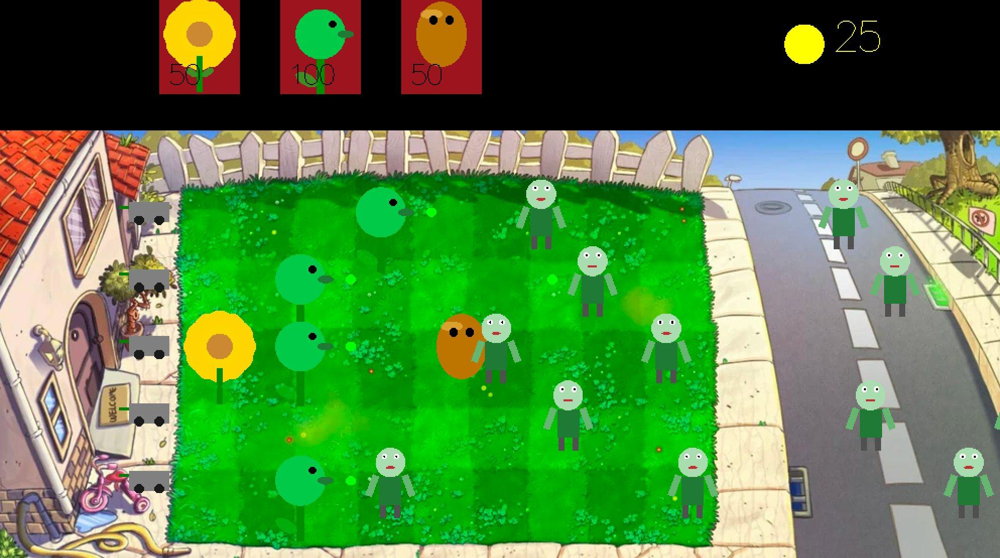

# Plants vs. Zombies in Haskell



*A screenshot of the game in action.*

## Gameplay
- **Goal:** Stop the wave of zombies by planting plants on the field.
- **Plants:**
  - Sunflower — generates sun.
  - Peashooter — shoots at zombies.
  - WallNut — blocks zombies.
- **Sun:** Click on sun to collect it and spend it to plant new plants.
- **Zombies:** Move from right to left along the lanes. If a zombie reaches the left edge, the game is over.
- **Lawnmowers:** Automatically destroy zombies if they reach the start of the lane.

## Controls
- Click on sun — collect sun.
- Click on a plant card — select a plant.
- Click on the field — plant the selected plant (if you have enough sun and the cell is free).

## Build and Run

1. Install [Stack](https://docs.haskellstack.org/en/stable/README/):
   ```
   curl -sSL https://get.haskellstack.org/ | sh
   ```
2. Clone the repository and go to the project folder.
3. Build the project:
   ```
   stack build
   ```
4. Run the game:
   ```
   stack run
   ```

## Dependencies
- [gloss](http://hackage.haskell.org/package/gloss)
- random

## Features
- Vector graphics for all objects (plants, zombies, sun).
- Zombies stop and bite plants.
- Sun appears near sunflowers, falls down, and can be collected by clicking.
- Lawnmowers destroy zombies if they reach the start of the lane.
  
---

## Extra features
- Oleg: implemented the main menu.
-	Ranis: added multiple difficulty levels and randomly falling suns, making the game more dynamic and challenging.
-	Mikhail: created a boss level, introducing a unique challenge and adding variety to the gameplay.

---

## Authors
- Ranis Haertdinov
- Oleg Stepanov
- Mikhail Akhatov

## Assets & Art Credits
- Frontyard background: PopCap Games (original PvZ)
- Plant, zombie, and sun sprites: Hand-drawn
- UI elements: Oleg Stepanov, Mikhail Akhatov

---

**Have fun!**

